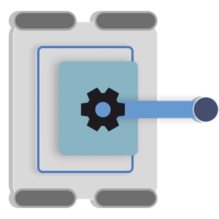
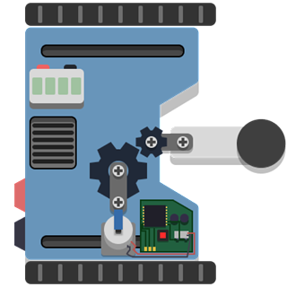
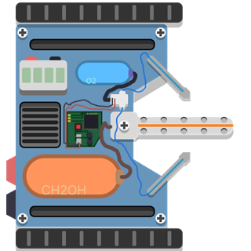
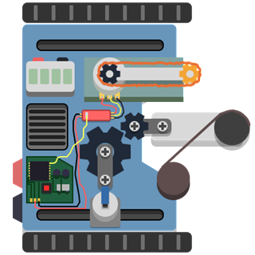
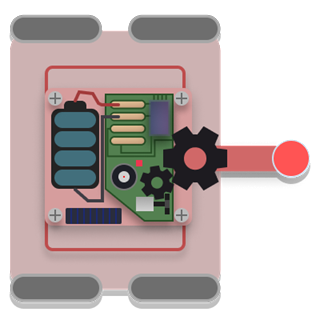
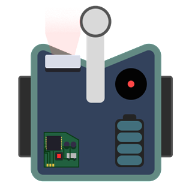
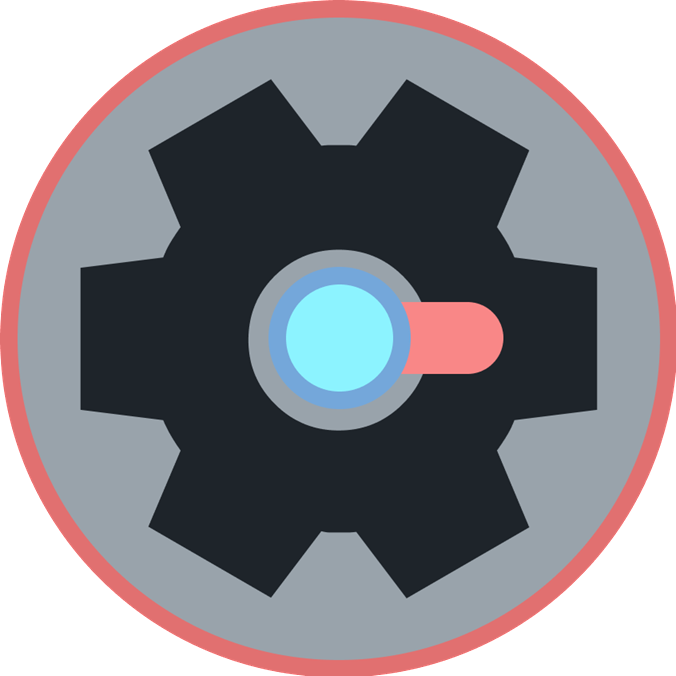
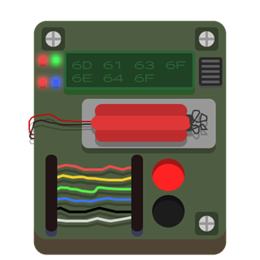

# Dead Again

[Gameplay GIF](https://cdn.hackclub.com/01a02eff-1cd2-7770-bb3c-6b44862e7c41/Dead%20Again.gif)

Dead Again is a 2D top down shooter game made from scratch in Java where your previous attempts are recorded and replayed as ghosts that help you finish the level.

> As of now, this game is only a demo. Many features are missing and (a lot of) bugs are to be expected.
## Gameplay

The player has multiple units/weapons and chooses their order before starting a level.

While playing, the player's actions are recorded. When they die, the recording is replayed by a ghost on the next attempt while the player controls the next unit.

The goal is to use your previous runs to help complete the level.

## Units

</img>
### Pistol
Has a fast pistol that does a small amount of damage.

**Health:** 100  
**Damage per shot:** 5  
**Cooldown:** 0.2s  
Controls:  
**LMB: Fire**

</img>
### Cannon
Can fire a cannon. The cannonball flies through the air, and explodes on reaching its target.

**Health:** 100  
**Explosion Damage:** 50  
**Cooldown:** 1s  
Controls:  
**LMB: Fire**

</img>
### Flamethrower
Can spray a continuous stream of fire, damaging anything in range. Entities that are lit on fire stay on fire for some time (5s) after leaving the fire.

**Health:** 200  
**Damage in fire:** 20/s  
**Damage while on fire:** 10/s  
Takes one second for fire to start.  
Controls:  
**LMB: Fire (Hold)**

</img>
### Chainsaw
Has a fast melee attack that damages enemies in range. It can also throw a chain and drag enemies closer, which also damages them.

**Health:** 500  
**Damage (Melee):** 40  
**Cooldown (Melee):** 0.5s  
**Damage (Pull):** 20  
**Cooldown (Pull):** 2s  
Controls:  
**LMB: Fire**  
**RMB: Pull**

### Other controls
**Movement:** WASD  
**Camera Zoom:** Scroll  
**Aim:** Mouse

**F3:** Debug Information  
**F3+R:** Restart level  
**X:** Self Destruct (Will not save recording)  
**Escape:** Pause Menu

**To win, eliminate all the enemies in the level (including bombs) and stay on the blue checkpoint near the end of the level.**

## Enemies

</img>
### Shooting Enemy
A basic Enemy that has a pistol. Has 100 health.

</img>
### Nanobot
Similar to the shooting enemy, but much smaller, has less health and does less damage.

</img>
### Turret
A turret stays in its place and doesn't move. It is more accurate and does more damage. It has more health than the shooter.

</img>
### Bomb
Walk through it, and it explodes. The explosion damages everything near it, including other enemies.

### Running
- Download the zip from the release (https://github.com/koino2/macondogame/releases/tag/release)
- Extract it
- Open macondogame
- Run DeadAgain.exe

You should not move the exe somewhere without all the other stuff in the folder because it has many important assets and stuff required.

### Building
Clone the repo and compile it with Main as the main class. Ensure the ```assets``` and ```figma``` are inside a "src" folder and kept in the working directory.

## Technical Documentation

Made with a custom engine with no external libraries.  
Following is the basic explanation of the main parts of the game: 

### Engine Structure
There is a primary ```Engine``` class which manages Scenes, Input, and Swing-related functionality.
#### Object2D
An object is the basic unit of *stuff* in a Scene.  
It can have objects parented to it as children.  
The object manages most of the collision (SAT collision) and object rendering systems, as well as a whole lot of other tiny shit.  

#### Scene
A ```Scene``` is a self contained game state.  
It has a collection of all objects in the scene.  
Each Scene is responsible for: 
- Creating and initializing its objects
- Updating objects every tick
- Rendering
- Managing the active camera 
- etc

Similar in concept to Unity's scenes.

#### Scripts
Scripts are things that can be attached to objects that have functions that get run during runtime.  
Each Script has two main lifecycle methods:  
- **start**: Runs once during the first frame when the object is in the scene and running
- **update**: Runs every update/tick. Takes deltaTime as an argument.  

Scripts can also have additional methods that are not mandatory, like:  
- **onDestroy**: Runs when an object is destroyed
- **renderUI**: Runs every render/frame and provides graphics utilities.

**The update cycle is independent from the rendering cycle, so ```update()```
does not necessarily run once per rendered frame.**


#### Input
Keyboard and Mouse Input is managed by a static Input class.  
Input is attached to the engine first with a JPanel, which adds a ```KeyListener``` and MouseListeners to the panel to listen to inputs.  
Then, it listens for key presses and mouse actions and appropriately adds/removes them from various different Sets.  
Scripts can access the Input class and listen to various inputs at any time, including pressed/released Inputs that automatically refresh.

#### Rendering
Rendering is done on Buffered Images and then rendered with Swing.  
The Rendering cycle happens mainly in these steps:  
- **Object Render:** Objects are drawn onto an image with no other processing.
- **Lighting:** Generates the lighting layer with all the lights in the scene and combines it with the main image.
- **Post Processing:** Runs all the PostProcessing Scripts that the scene has.
- **Final Render:** Other stuff and the image is drawn onto the panel.

The current renderer is CPU-bound because it uses Java's standard image/Swing rendering APIs rather than a GPU rendering API, which would need libraries or other dependencies.  
This engine attempts to render large, complex scenes with textures, lighting and post-processing with only Swing's barebones graphics APIs.  
As a result, performance is currently limited at higher resolutions in heavy scenes. (~30fps in moderately complex levels with multiple postprocessing effects applied, with an i7-12700H Laptop CPU)  
The rendering and post processing parts is mostly multithreaded where possible to keep performance high but it doesn't get much better than this.  

Since updates and frame renders are separate, the engine still achieves 600+ updates/ticks per second, since logic updates are much lighter on the CPU and is done on a different thread.

The engine also has a lot of other small systems like particles, animation and sound systems.

### Recording & Ghosts
The recording for weapons and movement is separate since multiple weapons can be used at once, but they both follow a similar structure:  
- ```RecordingFrame``` is one frame of a recording, which contains all the information about the current state of the player required.
- ```Recording``` is a collection of ```RecordingFrame```s and has some utilities to help playback and addition of frames.
- ```RecordingReader``` is a Script that plays back a Recording and updates the attached objects properties/data accordingly.
- ```PlayerRecorder``` is a Script attached to Player objects that creates RecordingFrames based on the current state of the player and adds them to a Recording.

When a player dies, their recordings are kept and used to create a Ghost on the next run. The Ghost uses the recordings to reproduce the previous run while the player controls the next unit.

<small>*i spent a lot of time writing this readme by hand so pls read it, no this is not ai sludge btw*</small>
